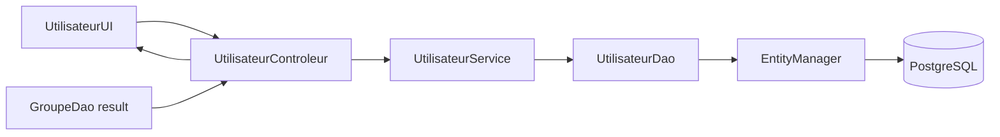

# A stale Swing selector: tracing JPA state across a desktop workflow

A database-backed desktop form can display old data even when its DAO query is correct. The reason is often not a cache inside JPA, but the lifetime of an ordinary Java object that holds the query result. A small Swing application for managing groups and users provides a concrete example: its user form receives a list of groups loaded when the controller starts, so groups created later are absent from that selector until the application is restarted.

This is a useful debugging lesson for desktop CRUD systems. Follow the value from the database to the component, and check when each object is created. A correct SQL query does not guarantee that a user interface asks for fresh results at the time the user needs them.

## Start with the relationship

The project has two JPA entities. `Groupe` maps to the `groupe` table and `Utilisateur` maps to `utilisateurs`. The user-side relationship is:

```java
@ManyToOne
@JoinColumn(name = "id_groupe")
private Groupe groupe;
```

This means a user can reference at most one group; the mapping does not declare the join column non-null. The business rule requires every user to have a group, so the current mapping does not enforce the requirement. There is no cascade setting on the association. The business rule prohibits deleting a group that still has users; the database foreign-key constraint rejects that deletion, but the current controller does not give a clear explanation. These behaviors follow from the entity mapping and controller implementation.

The desktop flow is deliberately layered. `AcceilControleur` connects home-screen buttons to group and user controllers. Those controllers call service classes, which delegate database work to DAOs. The DAOs use `EntityManager` against the `jpaPU` persistence unit and a PostgreSQL connection configured in `src/META-INF/persistence.xml`.



## Trace the selector value

The user controller declares its group controller and group list as fields:

```java
GroupeControleur gc = new GroupeControleur();
List<Groupe> listeGroupes = gc.TrouverGroupes();
```

Java evaluates those field initializers when it constructs `UtilisateurControleur`. The home controller creates that controller during application startup. Later, `UtilisateurUI` receives the stored `listeGroupes` and builds its combo box from that list. The list action for groups can query the database again, but it does not replace the value already held by the user controller.

That ordering explains the symptom:

1. Start the application while there are no groups, or with only the current groups in the database.
2. Add another group through the home screen.
3. Open the user form in the same application process.
4. The combo box still uses the list loaded during controller construction.

Restarting the application reconstructs the controller and reloads the groups. That is the current workaround documented for users. It is not a dynamic refresh feature, and it does not mean JPA failed to persist the new group.

## What the DAO does, and what it does not do

The group DAO's list operation executes a native query and maps rows back to `Groupe` entities:

```java
return em.createNativeQuery("SELECT * FROM groupe", Groupe.class)
		 .getResultList();
```

The query runs when `TrouverGroupes()` is called. The stale behavior appears because the user controller calls it only at construction time and retains the result. This distinction matters when diagnosing desktop applications: inspect both the data-access method and the owner of the returned collection.

Write methods in the DAOs create an `EntityManager`, begin a resource-local transaction, perform the operation, commit, and close the manager in `finally`. On an exception they roll back an active transaction and rethrow. The UI controllers do not consistently turn these underlying exceptions into useful user feedback; some update/delete paths print generic messages to standard output. A database error can therefore be harder to diagnose from the screen than from the application log or debugger.

## A better refresh boundary

The current code could be improved by loading the group list when the user opens the add or edit form, rather than storing it for the lifetime of `UtilisateurControleur`. Another design would provide an explicit refresh after group changes. The form should also present an appropriate state when no groups are available.

These are recommendations, not current behavior. Because group assignment is mandatory, the form should prevent saving a user without a selected group, and the persistence mapping should enforce the same rule. Relying on a non-empty combo box alone would not protect other code paths.

The deletion rule is also defined: a group with assigned users must not be deleted. The application should detect this condition and explain the restriction before attempting deletion. The current relationship has no cascade, and adding one would conflict with the confirmed rule by changing data semantics.

## Practical debugging checklist

When a Swing form shows missing or outdated records, trace these points in order:

- Which method queries the database, and does it return the expected rows?
- At what point is that method called: application startup, controller construction, or form opening?
- Which object owns the returned list, and how long does that object live?
- Does the view copy the list into a Swing model that also needs refreshing?
- What happens for an empty result, a cancelled selection, or a failed transaction?

For this project, the key lifetime is the controller field. The DAO list query is real, but the user form does not invoke it each time it opens. That small distinction turns a vague “JPA is stale” report into a specific refresh-boundary issue.

## Scope and lessons

The repository is a Java Swing/JPA/PostgreSQL desktop application, not a web service. It has no REST endpoint, HTTP request/response contract, or authentication API. Its visible home screen wires add, list, modify, and delete actions for the two entities, but some additional service methods are empty or return `null`; the existence of a method name alone is not proof of a complete workflow.

The practical lesson is to reason across object lifetimes as well as persistence layers. In a desktop application, controllers and view models often outlive a single database operation. Decide deliberately when data is loaded, who owns it, and what event invalidates it. Then document the actual behavior and its workaround separately from future improvements. This approach keeps both debugging and technical writing grounded in code rather than assumptions.
